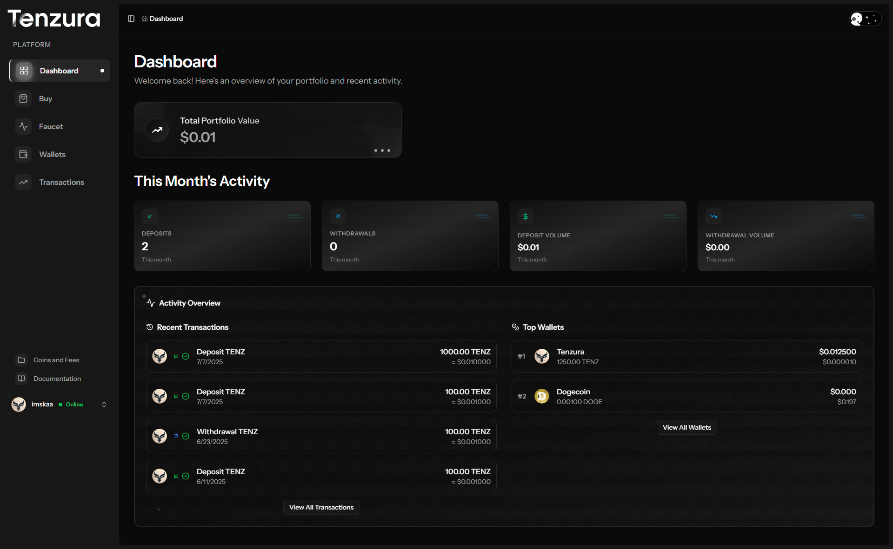
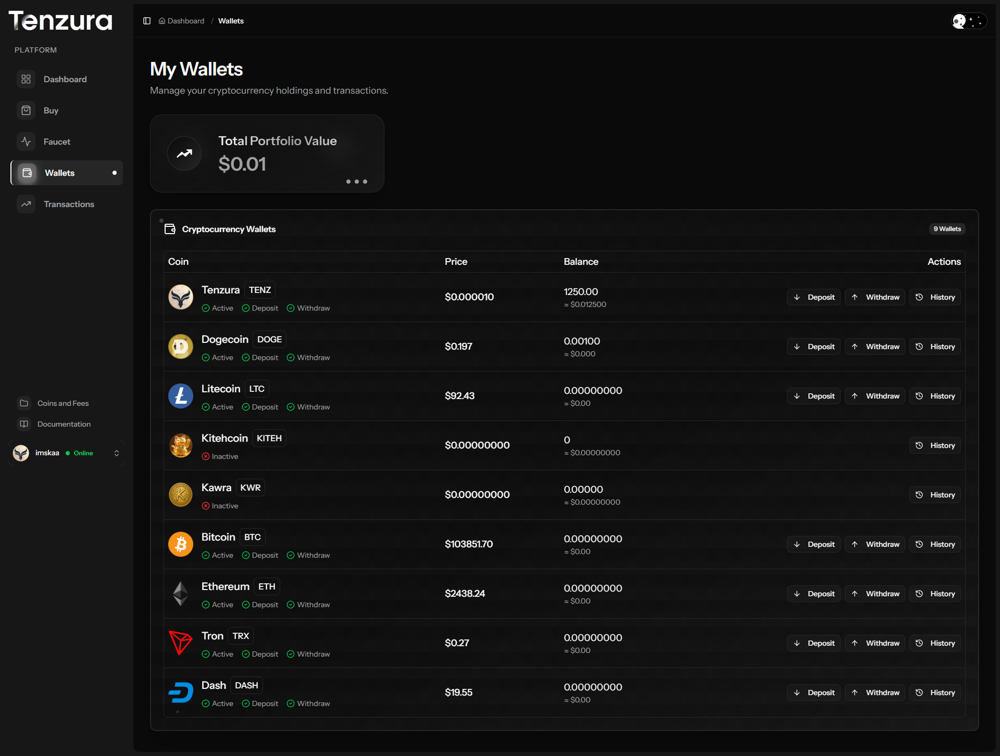
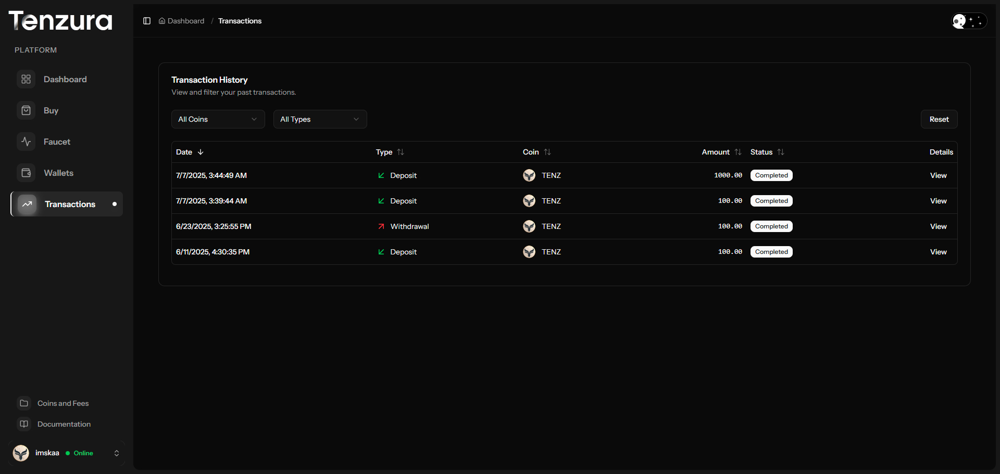
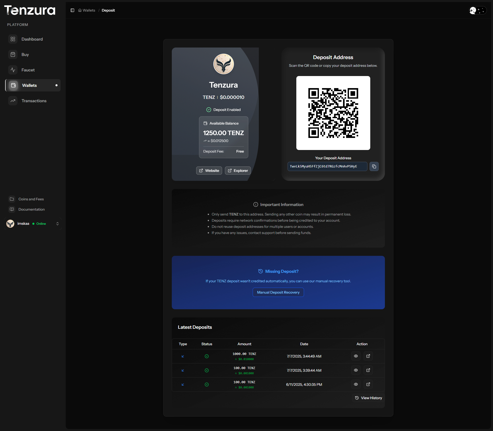
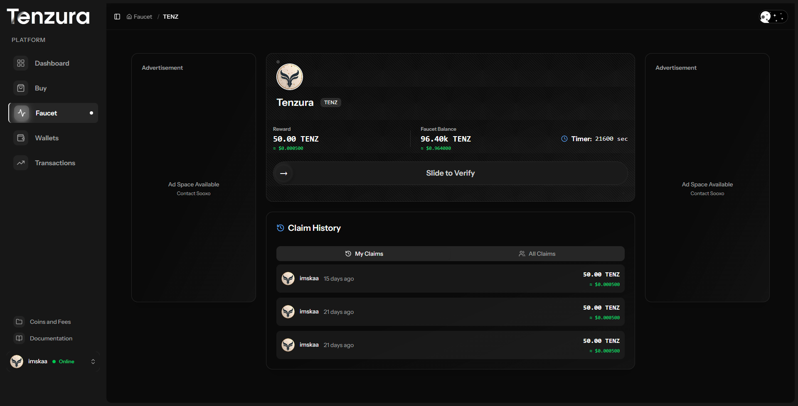
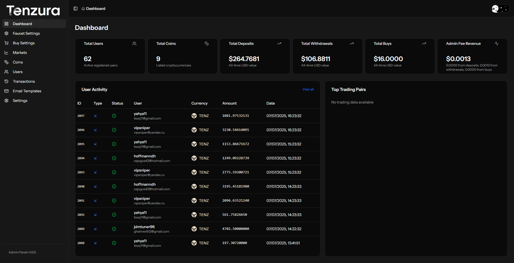
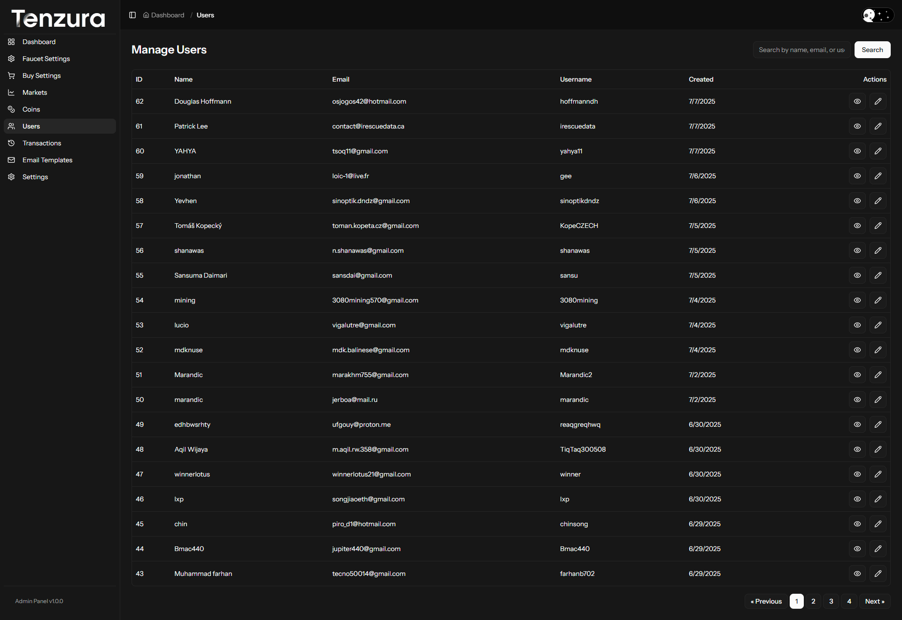
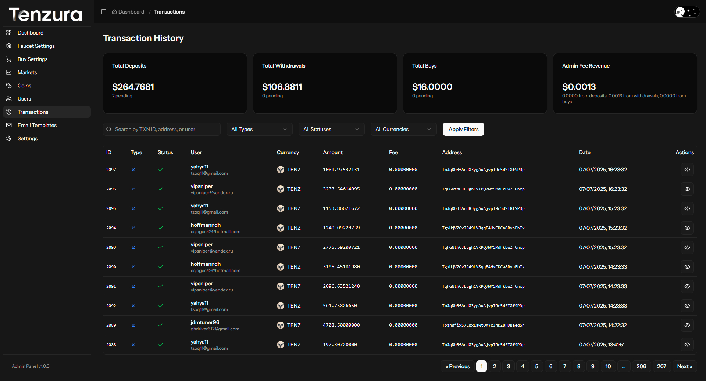
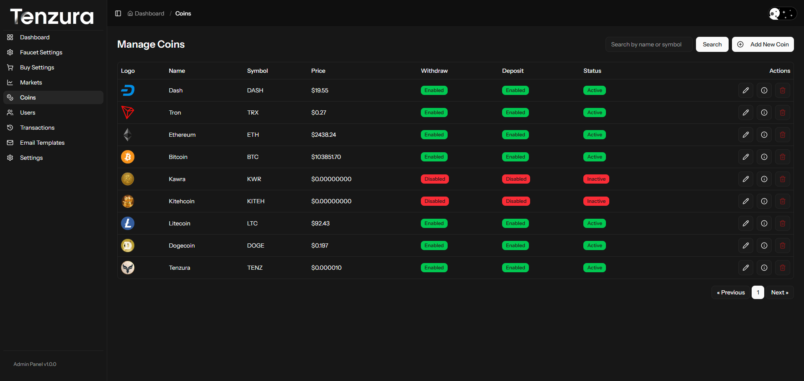
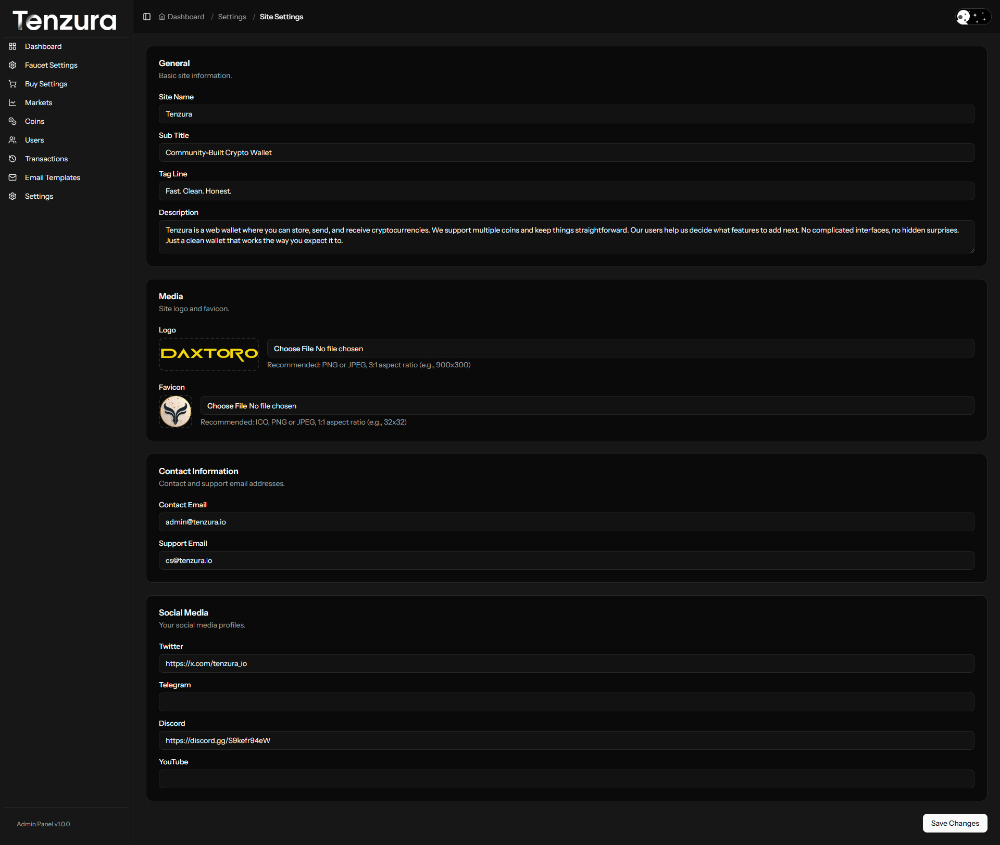

# 🚀 Tenzura Web Wallets - Complete Source Code

**A comprehensive, enterprise-grade cryptocurrency platform built with Laravel 12 & React**

> **💰 Source Code Available for $300** - Complete codebase with documentation and setup guides
> 
> **📂 Repository**: [github.com/soosho/tenzura-web-wallets](https://github.com/soosho/tenzura-web-wallets) | **🌍 Production Demo**: [www.tenzura.io](https://www.tenzura.io)

---

## 🌟 Overview

**Tenzura** is a **full-featured web wallet platform** where you can store, send, and receive cryptocurrencies. We support multiple coins and keep things straightforward, with no complicated interfaces or hidden surprises. This platform provides everything you need to launch your own crypto business, built with modern technologies and security best practices.

**🎯 Perfect for:**
- Cryptocurrency exchanges
- Multi-coin wallet services  
- Crypto faucet platforms
- Token distribution platforms
- Blockchain integration services
- Fintech startups

---

## 📸 Platform Screenshots

**See Tenzura in Action** - Professional, modern interface designed for cryptocurrency wallet management

### 👤 **User Interface**

#### Dashboard & Wallet Management

*Clean, intuitive user dashboard with account overview and quick access to key features*


*Multi-cryptocurrency wallet management with real-time balances*

#### Transactions & Features

*Comprehensive transaction history with detailed tracking*


*Simple and secure cryptocurrency deposit interface*


*Integrated faucet system for free cryptocurrency distribution*

### 🔧 **Admin Panel**

#### Administration Dashboard

*Comprehensive admin dashboard with analytics and system overview*

#### User & Transaction Management

*Complete user administration tools*


*Real-time transaction monitoring and management*

#### System Configuration

*Cryptocurrency management for adding and configuring supported coins*


*System settings for platform configuration*

### 📱 **Responsive Design**
- **Desktop**: Full-featured wallet interface
- **Tablet**: Touch-optimized experience  
- **Mobile**: Complete wallet functionality

### 🖼️ **View Complete Gallery**
👀 **[Admin Screenshots (22 images) →](screenshot/admin/README.md)** | **[User Screenshots (12 images) →](screenshot/user/README.md)** | **[Full Gallery →](screenshot/README.md)**

*Complete screenshot collection showcasing: Admin panels, user dashboards, wallet interfaces, transaction flows, and all major platform features*

---

## 💼 Business Value

### 🔥 Revenue Streams Built-In
- **Transaction Fees**: Configurable fees on deposits, withdrawals, and trades
- **Buy/Sell Marketplace**: Built-in trading functionality with profit margins
- **Faucet Advertising**: Monetize free cryptocurrency distribution
- **Premium Features**: User tier system ready for premium subscriptions
- **API Licensing**: White-label API for third-party integrations

### 📈 Market Ready Features
- **Multi-Currency Support**: Bitcoin, Ethereum, and any Bitcoind-compatible coins
- **Scalable Architecture**: Handles thousands of users and transactions
- **Mobile Responsive**: Works perfectly on all devices
- **SEO Optimized**: Built-in SEO features for organic growth
- **Admin Analytics**: Comprehensive dashboards for business insights

---

## 🛠️ Technology Stack

### **Backend (Laravel 12)**
- ✅ **PHP 8.2+** - Latest language features
- ✅ **Laravel 12** - Most advanced PHP framework
- ✅ **MySQL 8.0** - Robust database with optimized queries
- ✅ **Redis Caching** - High-performance caching layer
- ✅ **Queue System** - Background job processing
- ✅ **Email Integration** - SMTP with template system

### **Frontend (React + TypeScript)**
- ✅ **React 19** - Latest React with server components
- ✅ **TypeScript** - Type-safe development
- ✅ **Inertia.js** - Modern SPA experience
- ✅ **Tailwind CSS 4** - Beautiful, responsive design
- ✅ **Radix UI** - Accessible component library
- ✅ **Framer Motion** - Smooth animations
- ✅ **Lightweight Charts** - Professional trading charts

### **Blockchain Integration**
- ✅ **Bitcoind RPC** - Direct blockchain node integration
- ✅ **CoinPayments API** - 2000+ cryptocurrency support
- ✅ **Real-time Monitoring** - Automated deposit detection
- ✅ **Address Generation** - Secure wallet address creation
- ✅ **Transaction Verification** - Multi-confirmation security

---

## 🌟 Key Features

### 👤 **User Management System**
- User registration with email verification
- Profile management with avatar upload
- Multi-factor authentication ready
- Admin/user role system
- Comprehensive user analytics

### 💰 **Multi-Cryptocurrency Wallet**
- **Wallet Creation**: Automatic wallet generation for new users
- **Deposit System**: Real-time deposit detection and confirmation
- **Withdrawal System**: Secure withdrawal processing with admin controls
- **Address Management**: Multiple addresses per wallet support
- **Balance Tracking**: Real-time balance updates across all cryptocurrencies
- **Transaction History**: Complete audit trail with detailed logs

### 🎁 **Advanced Faucet System**
- **Free Cryptocurrency Distribution**: Configurable faucet amounts
- **Anti-Abuse Protection**: IP-based and user-based cooldowns
- **Global Cooldown Settings**: Flexible timing controls
- **Multiple Coin Support**: Faucets for any supported cryptocurrency
- **History Tracking**: Complete faucet claim history
- **Admin Controls**: Full faucet management from admin panel

### 🛒 **Buy/Sell Marketplace**
- **Cryptocurrency Trading**: Built-in buy/sell functionality
- **Dynamic Pricing**: Real-time price integration
- **Payment Processing**: Multiple payment methods support
- **Order Management**: Complete order lifecycle tracking
- **Fee Configuration**: Customizable transaction fees
- **USD Value Tracking**: Automatic USD conversion and tracking

### 🎛️ **Comprehensive Admin Panel**
- **Dashboard Analytics**: Revenue, user stats, transaction volumes
- **User Management**: Complete user administration tools
- **Coin Management**: Add/remove/configure cryptocurrencies
- **Transaction Monitoring**: Real-time transaction oversight
- **Settings Management**: Global platform configuration
- **Email Template Editor**: Customize all email communications
- **Fee Management**: Configure fees for all transaction types

### 🔐 **Security Features**
- **Encrypted Storage**: All sensitive data encrypted at rest
- **Secure API Endpoints**: Rate limiting and authentication
- **Transaction Verification**: Multi-confirmation blockchain verification
- **Admin Access Controls**: Role-based permission system
- **Audit Logging**: Complete activity tracking
- **Environment Protection**: Secure configuration management

### 📧 **Email System**
- **Welcome Emails**: Automated user onboarding
- **Transaction Notifications**: Deposit/withdrawal confirmations
- **Password Reset**: Secure password recovery
- **Email Verification**: Account verification system
- **Custom Templates**: Brandable email templates
- **SMTP Configuration**: Works with any email provider

### 📱 **Modern User Interface**
- **Responsive Design**: Perfect on mobile, tablet, and desktop
- **Dark/Light Mode**: User preference theme switching
- **Real-time Updates**: Live transaction status updates
- **Interactive Charts**: Professional trading charts
- **Smooth Animations**: Polished user experience
- **Accessibility**: WCAG compliant interface

---

## 🏗️ System Architecture

### **Database Design**
```
Users ─── Wallets ─── Transactions
  │         │           │
  │         │           └── Blockchain Integration
  │         │
  │         └── Wallet Addresses
  │
  ├── Faucet History
  ├── Buy Orders
  └── Admin Settings
```

### **Core Services**
- **BlockchainService**: Handles all blockchain interactions
- **WalletService**: Manages wallet operations and balances
- **BalanceService**: Real-time balance calculations
- **PaymentApiFactory**: Multi-API payment integration
- **ManualDepositService**: Manual deposit recovery tools

### **Background Processing**
- **Transaction Listener**: Real-time blockchain monitoring
- **Deposit Scanner**: Automated deposit detection
- **Email Queue**: Asynchronous email delivery
- **Cache Management**: Optimized data caching

---

## 📊 Admin Features

### **Real-time Dashboard**
- Total users, coins, and transaction volumes
- Revenue tracking (deposits, withdrawals, trades)
- Fee revenue breakdown
- Recent transaction monitoring
- User activity analytics

### **Coin Management**
- Add unlimited cryptocurrencies
- Configure RPC connections
- Set fees and limits
- Enable/disable coins
- Price and precision settings
- Explorer URL configuration

### **User Administration**
- View all user accounts
- Edit user profiles
- Admin privilege management
- User transaction history
- Account verification status

### **Transaction Oversight**
- View all platform transactions
- Transaction status management
- Manual transaction processing
- Detailed transaction logs
- Export capabilities

### **System Configuration**
- Email SMTP settings
- Payment API configurations
- Global platform settings
- Faucet cooldown settings
- Fee structure management

---

## 🚀 Installation & Setup

### **Quick Start (5 Minutes)**
```bash
# 1. Download and extract files
unzip tenzura-web-wallets.zip && cd tenzura-web-wallets

# 2. Install dependencies
composer install --no-dev --optimize-autoloader
npm install && npm run build

# 3. Configure environment
cp .env.example .env
php artisan key:generate

# 4. Setup database
php artisan migrate --seed

# 5. Start the application
php artisan serve
```

### **Production Deployment**
- Complete installation guide included
- Server configuration examples (Nginx/Apache)
- SSL certificate setup
- Performance optimization tips
- Security hardening checklist

---

## 💳 Payment Integration

### **Supported APIs**
- **CoinPayments**: 2000+ cryptocurrencies support
- **Bitcoind RPC**: Direct blockchain node integration
- **Custom APIs**: Easily extensible for new payment providers

### **Features**
- Automatic deposit detection
- Secure withdrawal processing
- Address validation
- Transaction status tracking
- Fee calculation and collection

---

## 📈 Performance Features

### **Optimization**
- **Redis Caching**: Fast data access and session management
- **Database Indexing**: Optimized query performance
- **Queue Processing**: Background job handling
- **CDN Ready**: Optimized for content delivery networks
- **Lazy Loading**: Efficient resource loading

### **Scalability**
- **Horizontal Scaling**: Multi-server support
- **Load Balancing**: Ready for traffic distribution
- **Database Clustering**: MySQL replication support
- **Microservice Ready**: Modular architecture

---

## 📚 Documentation Included

### **Complete Documentation Package**
- 📖 **Installation Guide**: Step-by-step setup instructions
- 🔧 **Configuration Manual**: All configuration options explained
- 🚀 **Deployment Guide**: Production deployment best practices
- 🔒 **Security Guide**: Security configuration and best practices
- 📊 **API Documentation**: Complete API reference
- 🛠️ **Development Guide**: Customization and extension guides

### **Support Materials**
- Database schema documentation
- API endpoint reference
- Configuration examples
- Troubleshooting guides
- Performance optimization tips

---

## 🎯 Business Applications

### **Launch Ready Platforms**
- **Cryptocurrency Exchange**: Full trading platform
- **Multi-Coin Wallet**: Secure wallet service
- **Faucet Network**: Cryptocurrency distribution
- **Payment Processor**: Accept crypto payments
- **Investment Platform**: Crypto investment tools

### **Customization Options**
- White-label branding
- Custom cryptocurrency integration
- Additional payment methods
- Extended trading features
- Mobile app API foundation

---

## 💰 Pricing & Value

### **💵 Price: $300 USD**

**🔥 What You Get:**
- ✅ Complete source code (PHP, React, TypeScript)
- ✅ Database migrations and seeders
- ✅ Comprehensive documentation
- ✅ Installation and deployment guides
- ✅ Email templates and assets
- ✅ Admin panel with full features
- ✅ Mobile-responsive design
- ✅ Security best practices implemented

### **💡 Development Value Comparison**
Building this platform from scratch would cost:
- **Senior Full-Stack Developer**: $150/hour × 200+ hours = $30,000+
- **UI/UX Design**: $5,000+
- **Security Audit**: $3,000+
- **Testing & QA**: $2,000+
- **Documentation**: $1,000+

**Total Development Cost: $41,000+**
**Your Investment: $300** ⚡ *Save 99.3%*

---

## 🏆 Technical Advantages

### **Modern Architecture**
- **Laravel 12**: Latest PHP framework with cutting-edge features
- **React 19**: Modern frontend with server components
- **TypeScript**: Type-safe development
- **Microservice Ready**: Scalable architecture

### **Security First**
- **Encrypted Data Storage**: Industry-standard encryption
- **API Rate Limiting**: DDoS protection
- **SQL Injection Protection**: Parameterized queries
- **XSS Protection**: Content Security Policy
- **CSRF Protection**: Built-in Laravel security

### **Performance Optimized**
- **Query Optimization**: Efficient database operations
- **Caching Strategy**: Multi-layer caching system
- **Background Processing**: Asynchronous operations
- **Resource Optimization**: Minimized loading times

---

## 🛡️ Security Features

### **Data Protection**
- Password hashing with bcrypt
- Encrypted sensitive data storage
- Secure session management
- Environment variable protection
- Database connection encryption

### **API Security**
- Rate limiting on all endpoints
- Authentication required for sensitive operations
- Input validation and sanitization
- CORS configuration
- API versioning support

### **Blockchain Security**
- Multi-confirmation transaction verification
- Address validation before transactions
- Secure private key management
- Audit trail for all operations
- Backup and recovery procedures

---

## 📞 Support & Updates

### **What's Included**
- Complete source code with comments
- Installation and configuration guides
- Database setup instructions
- Server deployment guides
- Email template customization guide

### **Post-Purchase**
- Basic setup support via email
- Bug fix guidance (if any)
- Configuration assistance
- Performance optimization tips

---

## 🚀 Get Started Today

### **Immediate Benefits**
- ⚡ **Quick Launch**: Deploy in under 30 minutes
- 💰 **Start Earning**: Multiple revenue streams ready
- 🔒 **Secure Foundation**: Enterprise-grade security
- 📱 **Mobile Ready**: Works on all devices
- 🌍 **Global Ready**: Multi-currency support
- 🎯 **Proven Success**: Live production demo at [tenzura.io](https://www.tenzura.io)

### **Perfect For**
- Entrepreneurs looking to enter crypto market
- Developers needing a solid foundation
- Businesses wanting to add crypto features
- Startups seeking proven solutions
- Investors looking for ready-to-deploy platforms

---

## 📋 System Requirements

### **Minimum Requirements**
- **Server**: 2GB RAM, 20GB storage
- **PHP**: 8.2 or higher
- **Database**: MySQL 8.0 or MariaDB 10.5+
- **Web Server**: Nginx or Apache
- **Node.js**: 18 or higher

### **Recommended**
- **Server**: 4GB RAM, 50GB SSD storage
- **SSL Certificate**: For production security
- **Redis**: For caching and sessions
- **CDN**: For global performance
- **Backup Solution**: For data protection

---

## 🎉 Special Offer

### **🔥 Limited Time: $300 (Regular Price: $500)**

**✨ Bonus Included:**
- Email support for first 30 days
- Additional documentation
- Performance optimization guide
- Security checklist
- Deployment automation scripts

### **🛒 Purchase Now**
Ready to launch your cryptocurrency platform? Get instant access to the complete Tenzura source code and start building your crypto business today!

**Contact for Purchase:**
- 📧 **Email**: soosho@proton.me
- 💬 **Telegram**: [@Sooxu_0](https://t.me/Sooxu_0)
- 🎮 **Discord**: sooxo_0
- 📂 **GitHub**: [github.com/soosho/tenzura-web-wallets](https://github.com/soosho/tenzura-web-wallets)
- 🌍 **Website**: [www.tenzura.io](https://www.tenzura.io)

---

**⭐ Join hundreds of satisfied customers who have successfully launched their crypto platforms with Tenzura!**

---

## 🌐 Links & Contact

- **🌍 Production Demo**: [www.tenzura.io](https://www.tenzura.io) - See the platform in action
- **📂 GitHub Repository**: [github.com/soosho/tenzura-web-wallets](https://github.com/soosho/tenzura-web-wallets)
- **📸 Screenshots**: [View All Screenshots](https://github.com/soosho/tenzura-web-wallets/tree/main/screenshot) - Complete visual overview

**💬 Contact for Purchase:**
- **📧 Email**: soosho@proton.me
- **💬 Telegram**: [@Sooxu_0](https://t.me/Sooxu_0)
- **🎮 Discord**: sooxo_0

---

*Tenzura Web Wallets - Built with ❤️ using Laravel, React, and modern blockchain technologies* 
