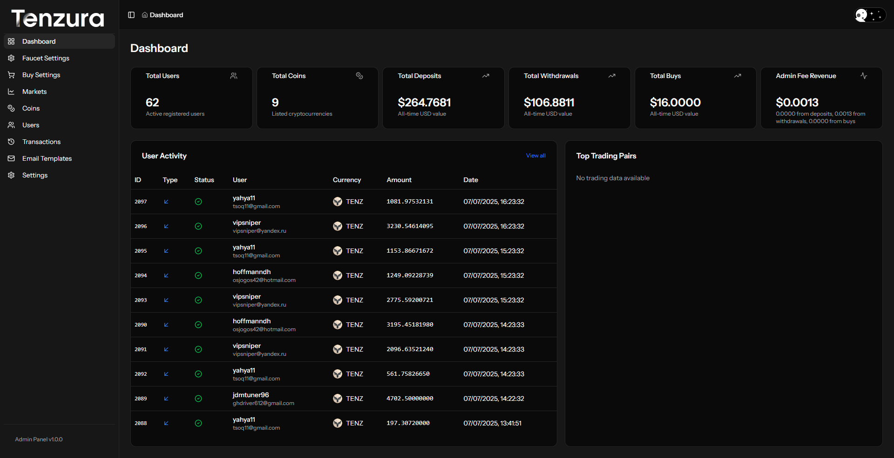
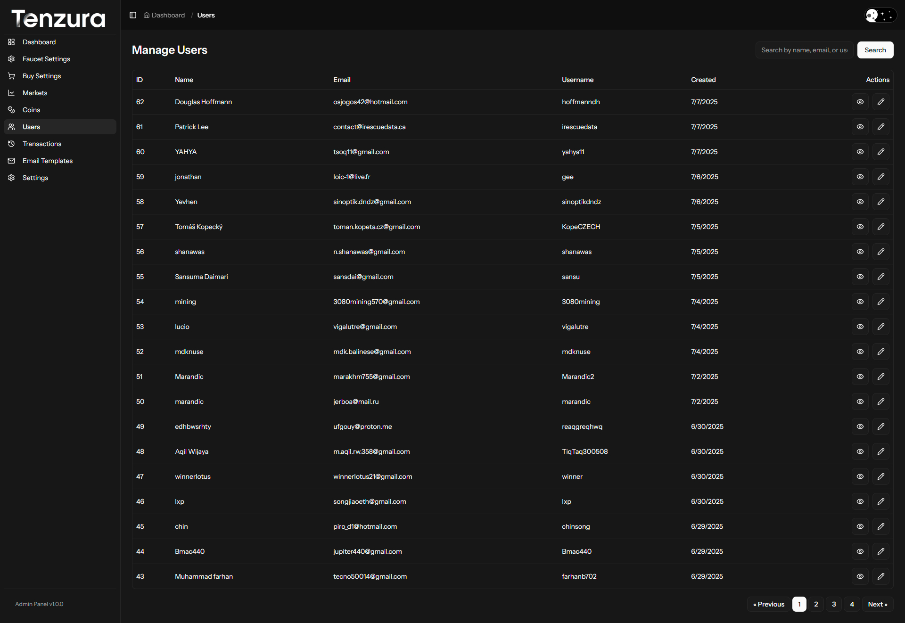
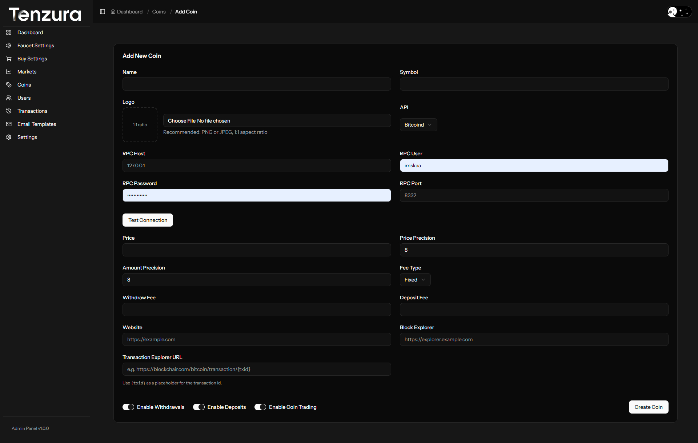
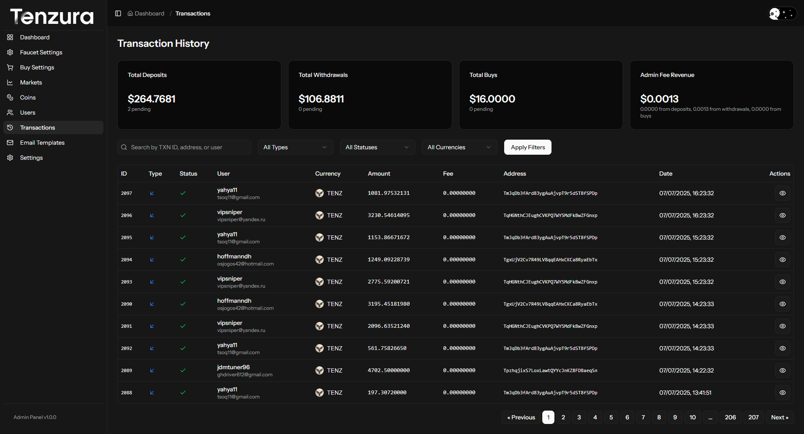
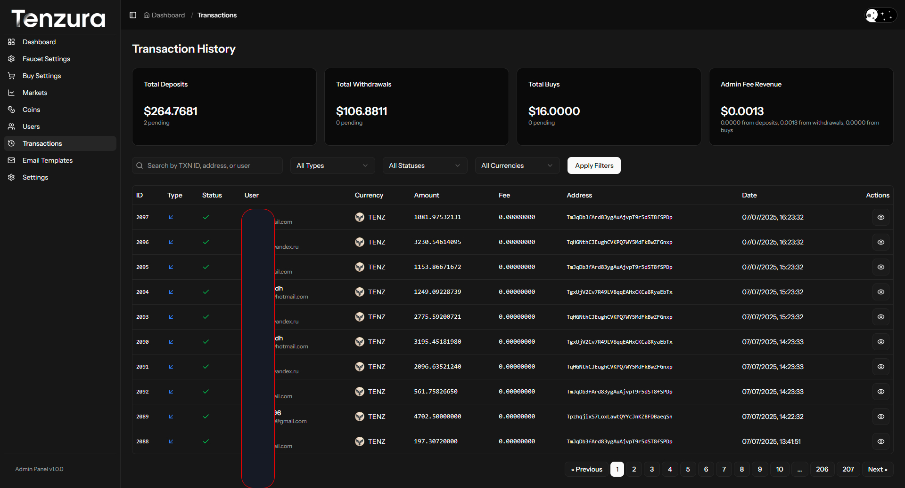

# Admin Panel Screenshots

This directory contains comprehensive screenshots of the Tenzura Web Wallets admin panel interface, showcasing all the administrative features and functionality available to administrators.

## Overview

The admin panel provides complete control over the web wallet system, including user management, cryptocurrency management, transaction oversight, and system configuration.

## Dashboard

The main admin dashboard provides an overview of system statistics and quick access to key functions.

## User Management

### Users List
View and manage all registered users in the system.

### User Details & Management
Detailed user information and editing capabilities.

## Cryptocurrency Management

### Coins Overview
Manage all supported cryptocurrencies and their configurations.

### Coin Operations
Add and configure new cryptocurrencies to the platform.

## Transaction Management

### Transactions Overview
Monitor and manage all transactions across the platform.

### Transaction Details
View detailed information about individual transactions.

## Buy/Purchase Features

### Buy Management
Configure and manage purchase options for users.

## Faucet System

### Faucet Management
Set up and manage cryptocurrency faucets for users.

## System Settings

### Site Configuration
Configure general site settings and parameters.

### Email Configuration
Set up SMTP settings for system email notifications.

### Payment Gateway Configuration
Configure CoinPayments integration for transaction processing.

## Features Demonstrated

- **User Management**: Complete user administration including viewing, editing, and managing user accounts
- **Cryptocurrency Support**: Add, edit, and configure multiple cryptocurrency wallets
- **Transaction Monitoring**: Real-time transaction tracking and management
- **Faucet System**: Built-in cryptocurrency faucet functionality
- **Purchase Integration**: Buy/sell functionality with payment gateway integration
- **System Configuration**: Comprehensive settings for site operation
- **Email Integration**: SMTP configuration for notifications
- **Payment Processing**: CoinPayments gateway integration

## Admin Capabilities

1. **Dashboard Analytics**: Overview of system performance and statistics
2. **User Administration**: Full user lifecycle management
3. **Wallet Management**: Multi-cryptocurrency wallet support
4. **Transaction Control**: Monitor and manage all platform transactions
5. **Faucet Administration**: Create and manage cryptocurrency faucets
6. **Purchase Management**: Configure buying/selling options
7. **System Configuration**: Site settings, email, and payment gateway setup
8. **Security Management**: User verification and account management

This admin panel provides a comprehensive interface for managing all aspects of the Tenzura Web Wallets platform, ensuring administrators have full control over users, transactions, cryptocurrencies, and system settings.
