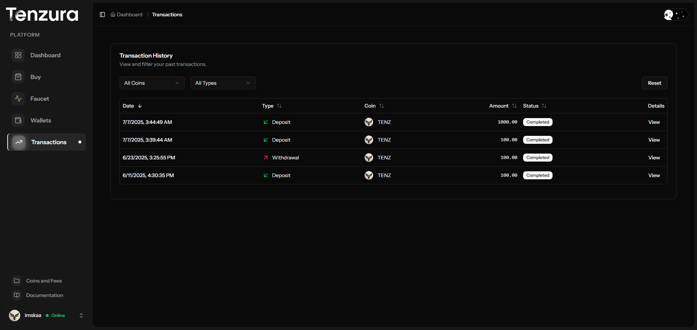
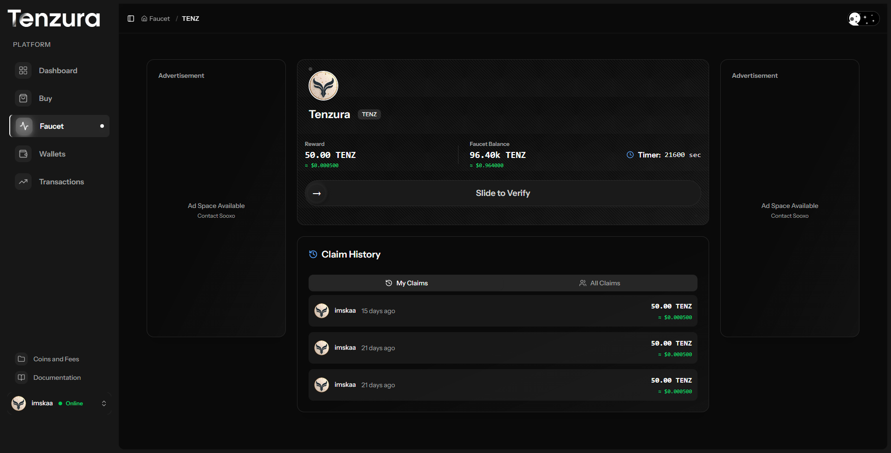

# User Interface Screenshots

This directory contains comprehensive screenshots of the Tenzura Web Wallets user interface, showcasing all the features and functionality available to end users.

## Overview

The user interface provides a complete cryptocurrency wallet experience, including wallet management, transactions, deposits, withdrawals, faucet access, and account customization.

## Landing Page

The main entry point for users to access the web wallet platform.

## Dashboard

The user dashboard provides an overview of account statistics, balances, and quick access to key wallet functions.

## Profile & Account Management

### User Profile
Manage personal account information and settings.

### Appearance Settings
Customize the interface appearance and user experience preferences.

## Wallet Management

### Wallets Overview
View and manage all cryptocurrency wallets in one place.

## Cryptocurrency Features

### Coins Management
Access and manage different cryptocurrency holdings and information.

## Transaction Management

### Transaction History
View comprehensive transaction history and details.

## Deposit & Withdrawal

### Deposit Functionality
Easy cryptocurrency deposit interface for funding wallets.

### Withdrawal Functionality
Secure withdrawal system for transferring cryptocurrencies.

## Faucet System

### Cryptocurrency Faucet
Access free cryptocurrency through the integrated faucet system.

## Self-Service Features

### Self-Service Portal
Access various self-service options and account management tools.

## Key User Features

- **Multi-Wallet Support**: Manage multiple cryptocurrency wallets from a single interface
- **Transaction Tracking**: Complete transaction history and real-time monitoring
- **Deposit/Withdrawal**: Secure cryptocurrency deposit and withdrawal functionality
- **Faucet Access**: Free cryptocurrency distribution through integrated faucets
- **Profile Management**: Complete account customization and settings
- **Appearance Customization**: Personalize the interface to user preferences
- **Self-Service Tools**: Comprehensive self-service options for account management

## User Experience Highlights

1. **Intuitive Dashboard**: Clean, user-friendly dashboard with essential information at a glance
2. **Seamless Navigation**: Easy access to all wallet functions and features
3. **Security Focus**: Secure transaction processing and account management
4. **Multi-Currency Support**: Support for various cryptocurrencies in one platform
5. **Real-Time Updates**: Live transaction status and balance updates
6. **Responsive Design**: Optimized interface for various devices and screen sizes
7. **Customization Options**: Personalized appearance and preference settings
8. **Faucet Integration**: Built-in cryptocurrency faucet for earning free coins

## Functionality Overview

### Wallet Operations
- View wallet balances across multiple cryptocurrencies
- Generate receiving addresses for deposits
- Initiate secure withdrawals to external addresses
- Monitor transaction confirmations in real-time

### Account Management
- Update profile information and security settings
- Customize interface appearance and preferences
- Access comprehensive transaction history
- Utilize self-service support tools

### Earning Opportunities
- Access cryptocurrency faucets for free coins
- Track faucet claim history and availability
- Manage earned cryptocurrencies alongside purchased holdings

This user interface demonstrates a comprehensive cryptocurrency wallet platform designed for ease of use, security, and functionality, providing users with all the tools they need to manage their digital assets effectively.
